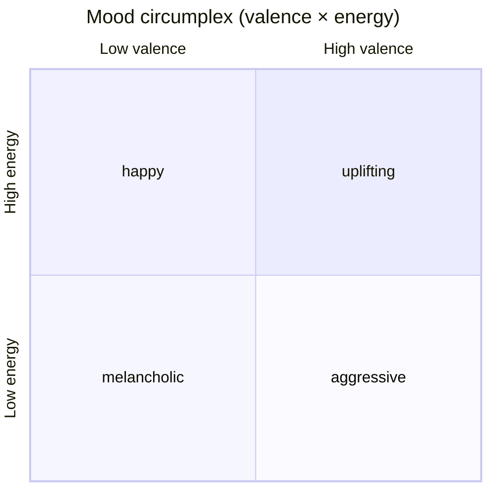

# Mood Reader

<p align="center">
  <strong>Classify song mood from lyrics and audio — no Spotify API required at inference time.</strong>
</p>

<p align="center">
  
  
  
  
</p>

---

Multimodal ML system that classifies **song mood, energy, and vibe** by fusing:

- **Lyrics** — emotion classification (DistilRoBERTa), VADER sentiment, theme keywords
- **Audio** — tempo, RMS energy, MFCCs, spectral shape, chroma (via librosa)

Outputs continuous **valence** (positive ↔ negative) and **energy** (calm ↔ intense), plus a discrete **vibe** label (`chill`, `happy`, `energetic`, `melancholic`, `aggressive`, `romantic`, `uplifting`, `dark`).

## Features

| | |
|---|---|
| **Multimodal fusion** | Lyrics NLP + librosa audio features → gradient boosting regressors/classifiers |
| **API-powered datasets** | Pull lyrics (Genius), Spotify features, and Last.fm tags into training CSVs |
| **Kaggle fallback** | Merge 30k Spotify tracks when API rate limits bite |
| **Fast mode** | `MOOD_READER_FAST=1` skips the HuggingFace emotion model for quick iteration |
| **Evaluation suite** | Train/test splits, circumplex charts, vibe confusion matrices under `models/` |

## Vibe taxonomy

Moods map to Russell's **circumplex model** (valence × energy):

| Vibe | Valence | Energy | Feel |
|------|---------|--------|------|
| `happy` | high | high | upbeat, joyful |
| `energetic` | mid–high | high | driving, intense |
| `uplifting` | high | mid | hopeful, anthemic |
| `chill` | mid | low | relaxed, laid-back |
| `romantic` | high | low–mid | tender, intimate |
| `melancholic` | low | low–mid | sad, reflective |
| `dark` | low | mid | brooding, ominous |
| `aggressive` | low | high | angry, heavy |



## Quick start

```bash
cd ~/Projects/mood_reader
python -m venv .venv
source .venv/bin/activate
pip install -r requirements.txt
cp .env.example .env   # add your API keys
```

### API keys

| Service | Env var | Sign up |
|---------|---------|---------|
| **Genius** (lyrics) | `GENIUS_ACCESS_TOKEN` | [genius.com/api-clients](https://genius.com/api-clients) |
| **Spotify** (valence, energy, tempo, preview) | `SPOTIFY_CLIENT_ID`, `SPOTIFY_CLIENT_SECRET` | [developer.spotify.com](https://developer.spotify.com/dashboard) |
| **Last.fm** (mood tags, optional) | `LASTFM_API_KEY` | [last.fm/api](https://www.last.fm/api/account/create) |
| **Kaggle** (valence/energy without Spotify API) | `KAGGLE_API_TOKEN` | [kaggle.com/settings](https://www.kaggle.com/settings) → API → Generate New Token |

### Merge lyrics with Kaggle Spotify features (recommended if Spotify API is rate-limited)

```bash
# Add KAGGLE_API_TOKEN to .env
python main.py merge-kaggle \
  --input data/discovered_songs.csv \
  --output data/discovered_songs_clean.csv

MOOD_READER_FAST=1 python main.py train --data data/discovered_songs_clean.csv
```

### Fetch songs from APIs

```bash
# Single track
python main.py fetch --artist "Daft Punk" --title "Get Lucky" --output data/fetched_songs.csv

# Batch from a track list
python main.py fetch --tracks data/sample/tracks.txt --download-previews --append

# Train on fetched data
MOOD_READER_FAST=1 python main.py train --data data/fetched_songs.csv
```

### Predict

```bash
# Auto-fetch lyrics + Spotify metadata
python main.py predict --artist "Billie Eilish" --title "bad guy" --use-preview

# Manual lyrics
MOOD_READER_FAST=1 python main.py predict \
  --lyrics "Bass hits like thunder, we never rest, dance until the dawn"
```

### Example output

```json
{
  "features_used": 47,
  "spotify_features_used": true,
  "valence": 0.721,
  "energy": 0.814,
  "valence_label": "positive",
  "energy_label": "high",
  "vibe": "energetic",
  "vibe_scores": {
    "energetic": 0.412,
    "happy": 0.281,
    "uplifting": 0.143,
    "aggressive": 0.089
  },
  "audio_analyzed": true
}
```

## CLI reference

| Command | Description |
|---------|-------------|
| `fetch` | Build a CSV from Genius + Spotify (+ optional preview MP3s) |
| `discover` | Sample diverse tracks on Spotify and fetch lyrics |
| `merge-kaggle` | Join lyrics CSV with Kaggle Spotify features |
| `clean` / `enrich` | Filter or backfill Spotify metadata on existing datasets |
| `train` | Fit valence, energy, and vibe models |
| `train-eval` | Holdout split with charts and metrics |
| `predict` | Score a single track by artist/title or raw lyrics |

## Dataset format

Create a CSV with at least a `lyrics` column. Optional columns:

| Column | Description |
|--------|-------------|
| `audio_path` | Path to `.mp3`, `.wav`, etc. |
| `vibe` | One of the 8 vibe labels |
| `valence` | Float 0–1 (negative → positive) |
| `energy` | Float 0–1 (calm → intense) |

See `data/sample/songs.csv` for 30 labeled examples (lyrics-only bootstrap).

For real training at scale, pair this with a dataset that has Spotify-style `valence`/`energy` labels (e.g. Kaggle Spotify tracks) and local audio files.

## Architecture

```
Lyrics ──► emotion model + VADER + keywords ──┐
                                               ├──► Gradient Boosting ──► valence / energy / vibe
Audio  ──► librosa (tempo, MFCC, spectral) ──┘
```

Three models are saved under `models/`:

- `valence_model.joblib` — regression
- `energy_model.joblib` — regression
- `vibe_model.joblib` — classification

If no audio file is provided, audio features are zero-filled at train time; add audio paths to improve beat/energy accuracy.

## Environment variables

| Variable | Effect |
|----------|--------|
| `GENIUS_ACCESS_TOKEN` | Required for lyrics fetch |
| `SPOTIFY_CLIENT_ID` / `SPOTIFY_CLIENT_SECRET` | Spotify audio features + 30s previews |
| `LASTFM_API_KEY` | Optional mood/genre tags |
| `KAGGLE_API_TOKEN` | Download Kaggle Spotify features dataset |
| `MOOD_READER_FAST=1` | Skip HuggingFace emotion model; use lightweight rule-based lyrics scoring |

## Project layout

```
mood_reader/
├── main.py                 # CLI (fetch / train / predict)
├── config.yaml             # vibes, model hyperparams, API settings
├── .env.example            # API key template
├── mood_reader/
│   ├── apis/
│   │   ├── genius.py       # lyrics via Genius
│   │   ├── spotify.py      # valence, energy, tempo, previews
│   │   ├── lastfm.py       # crowd mood tags
│   │   └── song_lookup.py  # unified lookup
│   ├── fetch.py            # build CSV datasets from APIs
│   ├── audio_features.py   # librosa feature extraction
│   ├── lyrics_features.py  # NLP + emotion features
│   ├── fusion.py           # combine modalities
│   ├── train.py            # training pipeline
│   └── predict.py          # inference
├── data/sample/
│   ├── songs.csv           # starter labeled dataset
│   └── tracks.txt          # sample track list for fetch
└── models/                 # trained artifacts (gitignored)
```

## Data pipeline

```
Artist + Title
      │
      ├── Genius API ──────► lyrics
      ├── Spotify API ─────► valence, energy, tempo, preview MP3
      └── Last.fm API ─────► mood tags (optional)
      │
      ▼
  fetched_songs.csv ──► train ──► models/
                      └── predict (lyrics + optional preview audio)
```

---

<p align="center">
  <sub>Built for music discovery, playlist curation, and mood-aware recommendations.</sub>
</p>
